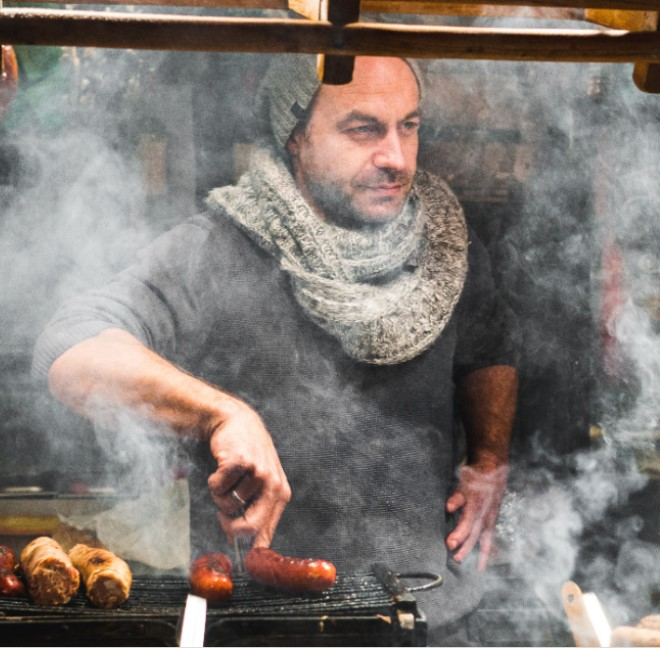

# Bongo for restaurant business
> One page website template for restaurants

## Table of contents
* [General info](#general-info)
* [Screenshots](#screenshots)
* [Technologies](#technologies)
* [Features](#features)
* [Status](#status)
* [Copyrights](#inspiration)
* [Contact](#contact)

## General info
Using one-page website is great because it removes the clutter. You can focus only on the essentials and call to action. 

## Screenshots
[screenshot](./images/bongo_screenshot_1.jpg)
[screenshot](./images/bongo_screenshot_2.jpg)
[screenshot-mobile](./images/bongo_mob_screenshot_1.jpg)

## Technologies
* HTML5
* CSS3
* Animate.css - version 3.7.0
* JQuery - version 3.3.1

## Code Example
            <!-- Team section -->
            <section id="teamSection" class="team">
                

                    <h2>Our Chefs</h2>
                

                

                    

                        
                            

                                
                                

                                    

                                        <a href="#"><i class="fab fa-twitter"></i></a>
                                        <a href="#"><i class="fab fa-facebook"></i></a>
                                        <a href="#"><i class="fab fa-instagram"></i></a>
                                    

                                

                            

                        
                        <h3>Chef Anatolio</h3>
                        
Lorem ipsum dolor sit amet consectetur adipisicing elit. Animi, assumenda.

                    

                

            </section>
## Features
* Fully responsive
* Smoothly jump-to-section function
* Animations

To-do list:
* Contact form validation
* Cross browser compatibility

## Status
Project is: in progress.

## Copyrights
All images come from the Creative Common stock of Unsplash.

## Contact
Created by [@ivomirs] www.linkedin.com/in/ivomirs - feel free to contact me!
